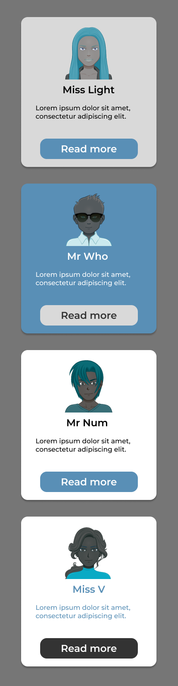

# dojo-js-css-cards

Ce dojo est issu du [template monorepo JS](https://github.com/WildCodeSchool/create-js-monorepo/).

## Installation et démarrage

1. Une fois cloné, installer le projet avec la commande `npm install` 
2. Démarrer avec `npm run dev`. 
3. Accéder à l'application sur http://localhost:3000/
  
## Instructions
À partir de la maquette fournie `./docs/images/mockup-cards.png`, réaliser l'intégration HTML/CSS de cartes utilisateurs générées en parcourant un tableau de données.  
Le fichier `./src/App.tsx` contient déjà une structure de base pour démarrer. Il fait appel à un fichier  `./src/data/users.json` contenant des données ainsi qu'un fichier `App.css` pour un style de départ.

### Étapes à suivre
1. Créer un composant `Card` qui affichera les informations d'un utilisateur (name, description, image).
2. Dans le fichier `App.tsx`, importer le composant `Card` et l'utiliser pour afficher la liste des utilisateurs importée du fichier `users.json` à l'intérieur du conteneur `.cards-container`.
3. Créer un fichier CSS `Card.css` pour styliser le composant `Card` en suivant la maquette fournie.

### Consignes pour le CSS
- Commencer par styliser toutes les cartes avec un style identique.
- Utiliser des sélecteurs CSS pour cibler les éléments (ex: `h1`, `p`, etc.) plutôt que d'ajouter des classes supplémentaires.
- Optimiser le CSS à l'aide de variables CSS.
- Utiliser les pseudos-sélecteurs pour créer des cartes différentes en fonction de leur position.
- 🖋️ Typographie : 
  - [Montserrat](https://fonts.google.com/specimen/Montserrat) pour les titres, le texte et les boutons
- 🎨 Codes couleurs : 
  - `#598FB6` pour le bleu
  - `#D9D9D9` pour le gris
  - `#333333` pour le noir
  - `#FFFFFF` pour le blanc

### Aperçu de la maquette
